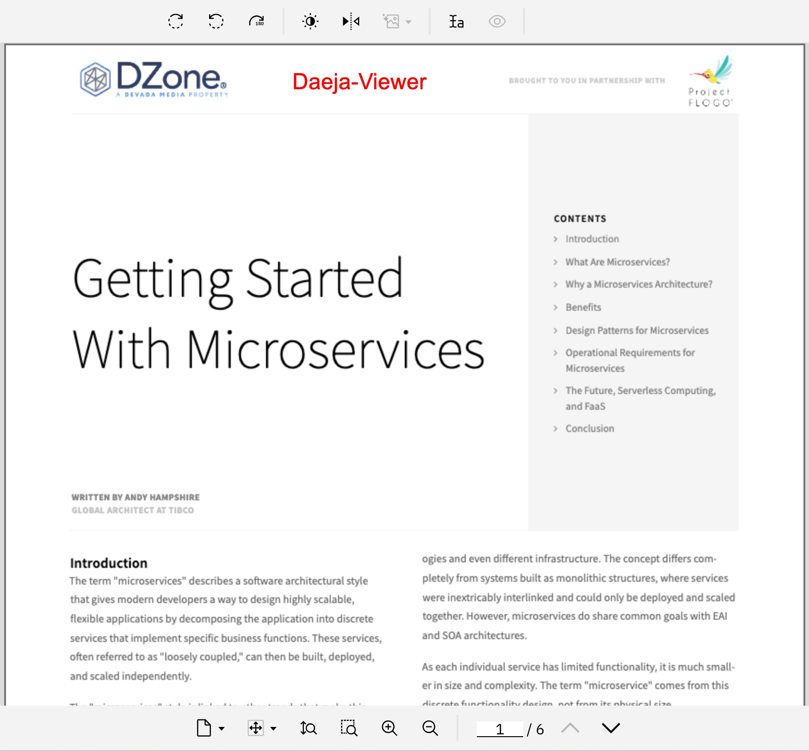
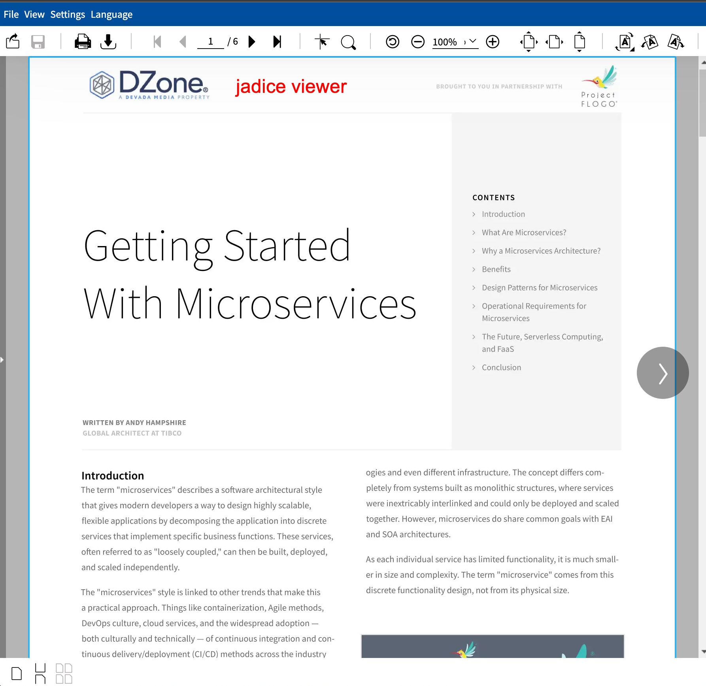

# webtoolkit-icn-plugin: ICN Plugin for jadice web toolkit

jadice® web toolkit is a web-based multi-format viewer for several formats like PDF, TIFF, AFP, MO:DCA, PNG, JPEG and more. 
With this plugin jadice can be configured in IBM Content Navigator as viewer for documents instead of Daeja One Viewer.

## Features

Below is a small list with features of the jadice web toolkit viewer

| Feature                        | Available          |
|--------------------------------| ------------------ |
| P8 Annotations (read)          | :heavy_check_mark: |
| P8 Annotations (write)         | :heavy_check_mark: |
| Filenet IS Annotations (read)  | :heavy_check_mark: |
| Extensibility                  | :star: :star: :star: |
| configurable render quality    | :heavy_check_mark: |
| viewer can be used outside ICN | :heavy_check_mark: |
| OCR layer support              | :heavy_check_mark: |
| Javascript API for viewer      | :heavy_check_mark: |

### Render Quality

<a href="docs/daeja.jpg"></a>
<a href="docs/webtoolkit.jpg"></a>

## Version support

This plugin requires Content Navigator version 3.0.x and was tested with version 3.0.7 and version 3.0.9

## Installation

### Plugin Installation
1. Make sure the plugin JAR-file (e.g. webtoolkit-content-navigator-plugin-1.2.0.jar) is accessible from Content Navigator
2. Install the plugin via the admin-panel
3. Make sure you correctly define the "jadice web toolkit URL" field in the plugin installation process (e.g. http://myicnhost/webtoolkit , see below).
4. Create a view-mapping for the new plugin in the admin-panel
5. Make sure the view-mapping is applied for the desired desktop

### jadice web toolkit Installation

This url of jadice web toolkit configured in the plugin is used by the Content Navigator server to transfer 
the documents to the jadice web toolkit and in the viewing window of the web-browser (client). 
As the Content Navigator has a strict same-origin-policy, this URL must use the same base-path as the Content Navigator 
itself. To achieve this, either deploy the jadice web toolkit WAR-file on the same application server as the 
Content Navigator or use a proxy. Chapter 9.8 of the "*Customizing and Extending
IBM Content Navigator*" Redbook provides more information about this setup. Hint: configure `underscores_in_headers on` 
in Nginx if you're using Nginx as reverse-proxy.

#### Sidecar-deployment

In this setup, jadice web toolkit is installed on the same application server as the Content Navigator.
With this scenario you don't have to worry about same-origin problems. Unfortunately, if you need write
support for annotations, this setup won't work as the IBM P8 libraries seem to interfere with the libraries
that are loaded by the Content Navigator. The solution is a standalone-deployment of jadice web toolkit.

#### Standalone & Nginx

You can deploy jadice web toolkit to any other application server or run it as standalone application with Spring Boot.
Since the Content Navigator plugin embeds the jadice viewer with an iframe, the same-policy-origin blocks the viewer
from rendering in this setup. A reverse-proxy is needed to the Content Navigator and the jadice viewer do have
the same origin.

If you choose Nginx for this job, make sure you enable the option `underscores_in_headers on` in the server-block.
An example configuration could look like this:
```text
server {
  server_name ecm.levigo.de;
  listen 8080 default_server;
  underscores_in_headers on;

  location /navigator/ {
    proxy_pass http://localhost:9081/navigator/;
    proxy_set_header X-Real-IP $remote_addr;
    proxy_set_header X-Forwarded-For $proxy_add_x_forwarded_for;
  }

  location /webtoolkit/ {
    proxy_pass http://localhost:8090/webtoolkit/;
  }
}
```

### Configuring write support for annotations

Since version 1.2.0 of the plugin, it is possible to persist changes made to a document. The annotations are directly
stored to the P8 repository. All you have to do is configure the plugin in the admin panel accordingly.

## Integration

### jadice web toolkit content navigator standalone viewer

The standalone viewer is ready-to-use and can directly be used as a viewer for the Content Navigator. It is an optimized version of the **enterprise demo** that is part of the jadice web toolkit artifact.

1. deploy the webtoolkit-content-navigator-integration WAR-file to the same application server as the Content Navigator. This is mandatory as the Content Navigator enforces same-origin-policy
2. deploy the WAR-file with the context path "webtoolkit" so that it is reachable via e.g. http://myicnhost/webtoolkit (where Content Navigator is accessible via http://myicnhost/navigator )

### existing jadice web toolkit integration

If you already have a running jadice web toolkit installation, you can use the following module to extend the integration, so it can communicate with the webtoolkit-icn-plugin

```xml
<dependency>
    <groupId>com.levigo.jadice.webtoolkit</groupId>
    <artifactId>webtoolkit-content-navigator-integration</artifactId>
</dependency>
```

The module is part of the jadice web toolkit and bound to the respective version. More information can be found in the README.md of this module.

## Development

- Get a j2ee.jar (e.g. from your Application server) and place it under /lib
- Get navigatorAPI.jar from Content Navigator and place it under /lib
- Run maven task e.g. `mvn install`

## License

[Apache License 2.0](https://github.com/levigo/webtoolkit-icn-plugin/blob/master/LICENSE)
